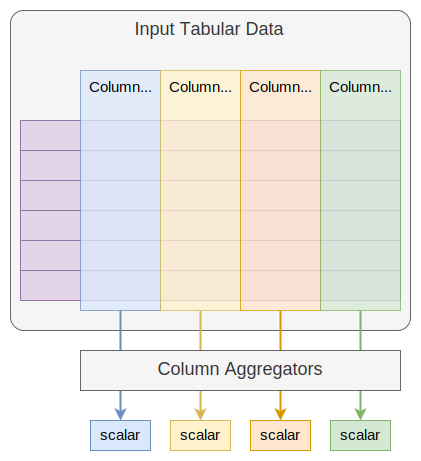

# Python Project demo

This repository contains a demo Python project that gives concrete examples on
the [guidelines] we provided. You may refer this project when starting your own
Python projects in JQ.

[guidelines]: https://v9kg4fi819.feishu.cn/docx/LAJ9dc1esox2dqxhGQpc00BdnCe

## The Demo

The name of this demo project is `jsda` (which is an acronym for "Jiaqi Simple
Data Aggregator"). It implements a very simple _data aggregator_. The input to a
data aggregator is a 2-dimensional tabular data represented as a pandas data
frame. The input data frame contains multiple columns (series) that contain data
to be aggregated together. The output of the data aggregator is a dictionary
that maps input column names to scalar values. The following figure illustrates
the concept:

This demo data aggregator supports the following features:

- Support multiple types of data sources: local files, DataCore, etc. New types
  of input data sources can also be easily added.
- Support multiple types of data aggregation algorithms: `min`, `max`,
  `average`, `medium`, etc. New algorithms can also be easily added.

## Project Structure

See [ProjectStructure.md](./docs/ProjectStructure.md).

## Design

See [Design.md](./docs/Design.md).

## Development

See [Development.md](./docs/Development.md).

## Packaging & Release

See [PackagingAndRelease.md](./docs/PackagingAndRelease.md).
